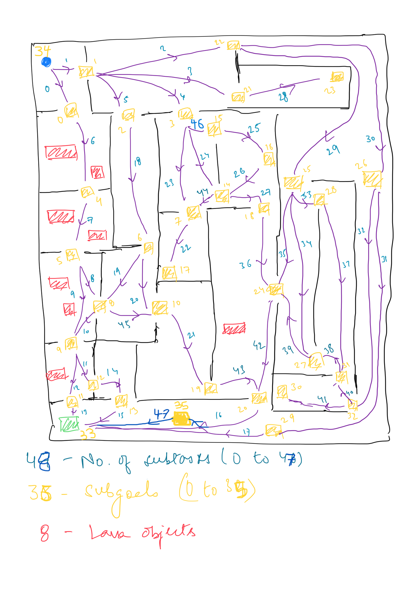

# unity_labyrinth Modded
Unity ML-Agents project that acts as a labyrinth environment for reinforcement learning navigationt asks.

## Installation
- Begin by installing the Unity Hub. Here is the [download link](https://unity.com/download#how-get-started).
- Next use the Unity Hub to install the appropriate version of Unity (This project was built using Unity 2020.3.20f1).
- Finally, after cloning this repository locally, drag the entire folder structure into the project list on Unity Hub. Use the Unity Hub to open the newly created project in order to get started.

## Current setup

